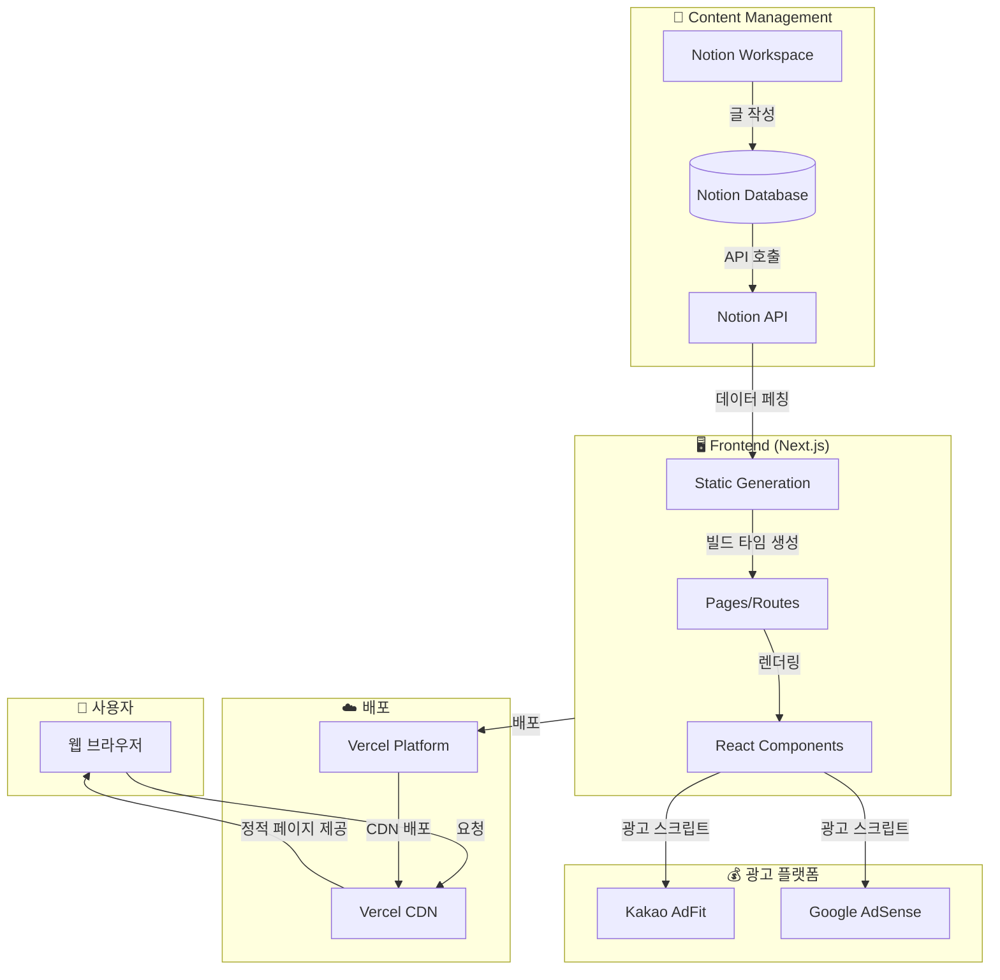
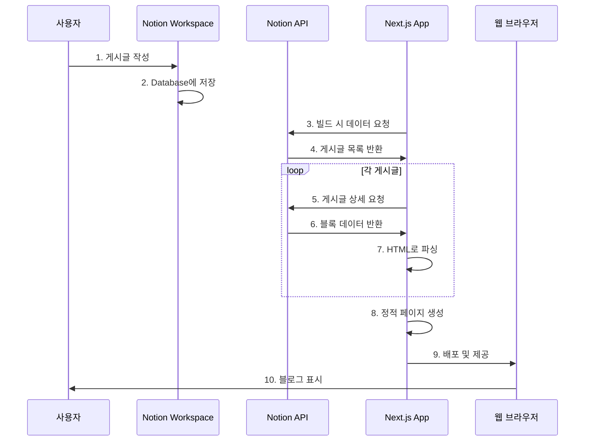
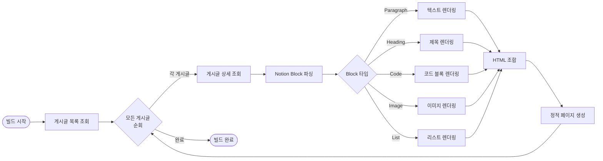
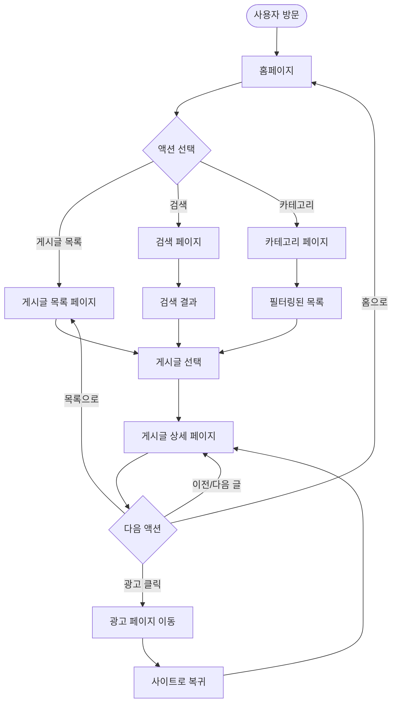
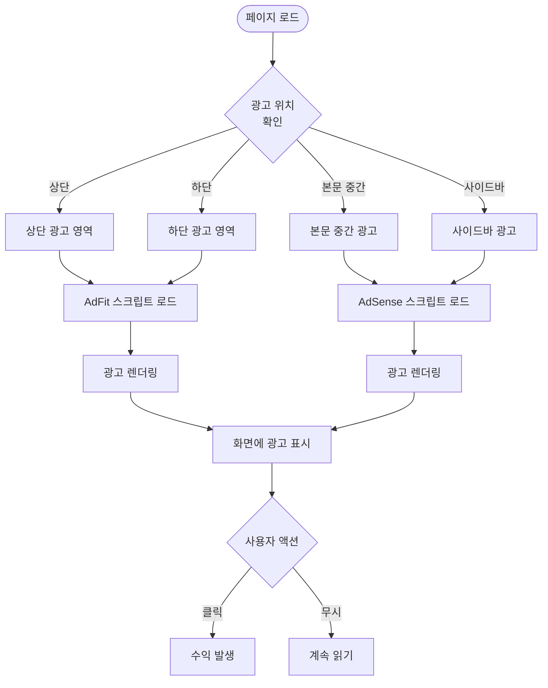
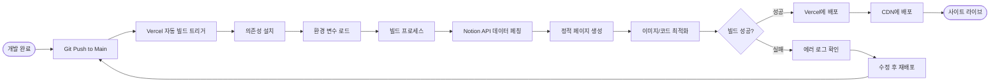
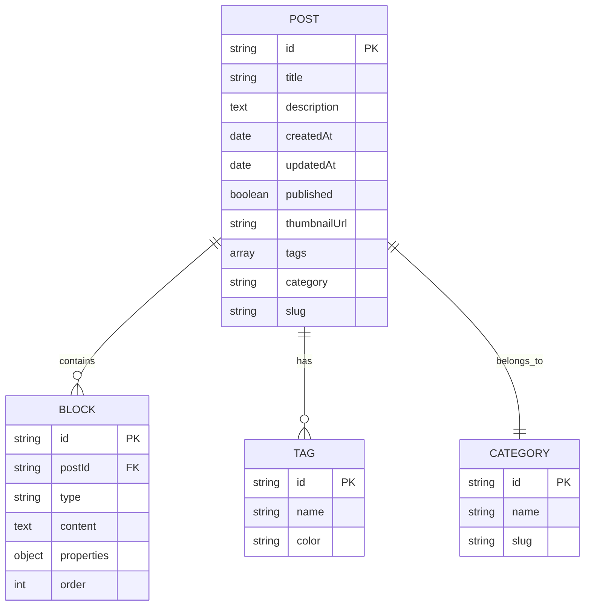
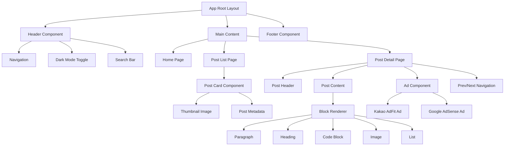
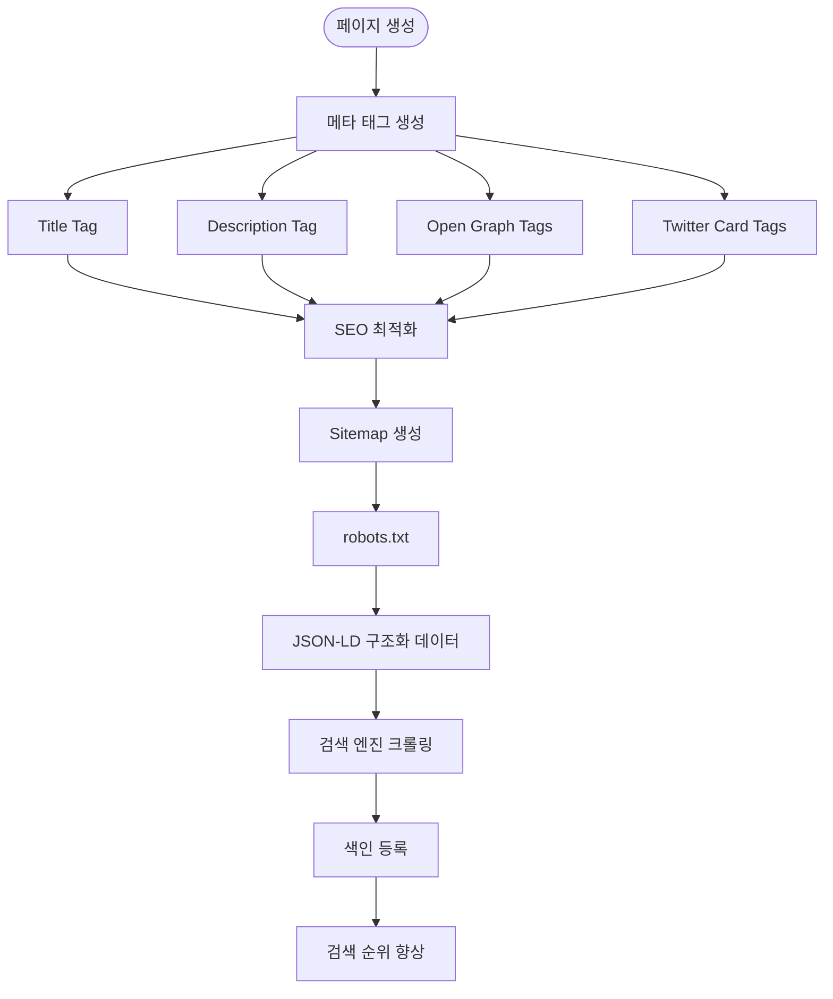
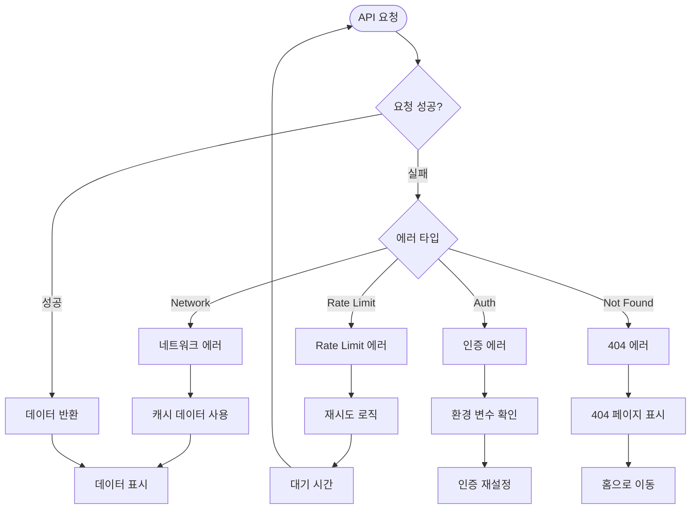

# Mermaid.md
# 프로젝트 플로우차트 및 아키텍처 다이어그램

## 1. 전체 시스템 아키텍처

---

## 2. Notion API 데이터 흐름

---

## 3. 게시글 렌더링 프로세스

---

## 4. 사용자 플로우 (User Flow)

---

## 5. 광고 통합 플로우

---

## 6. 빌드 및 배포 프로세스

---

## 7. 데이터베이스 구조 (Notion Database)

---

## 8. 컴포넌트 계층 구조

---

## 9. SEO 최적화 플로우

---

## 10. 에러 처리 플로우

---

**문서 끝**
